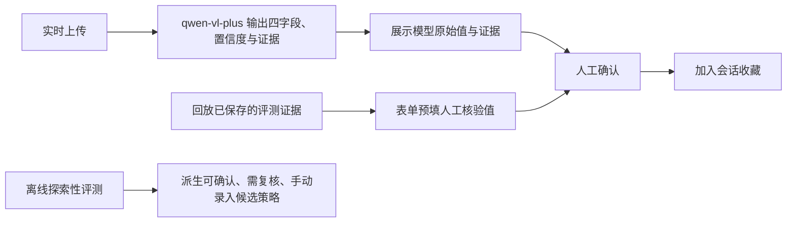

# 旅途：让 AI 识别旅行照片，也让人看见它何时不可靠

> 统一事实口径：模型为 `qwen-vl-plus`；30 个主评测样本，文字、地标、弱线索各 10 个；国家 29/30、地区 16/30、城市 16/30、景点 14/30；22 次可确认、4 次需复核、4 次手动录入；共完成 15 次重复调用，其中 2 个完全稳定；5 个结构化 Badcase；5 次单变量 Prompt 复测；总计 50 次真实模型调用。

> 产品边界：这是探索性评测，不是统计结论，也不代表用户效果。三档策略来自离线评测，不是当前实时链路中的自动执行分支。当前实时识别结果统一进入人工确认。回放模式是保存并展示评测证据的演示，人工确认表单以人工核验值预填。

> 协作边界：用户提出痛点与基本功能，在对话中选择方向、批准规格和结果。AI 代理负责方案细化、代码、公开样本与标注、模型调用、测试、复测和文档草稿。

## 问题

旅行照片常缺少地点信息，人工回忆和搜索成本高；模型若直接写入错误地点，还会污染路线、地图和游记。项目关注如何展示证据并统一交给人确认，同时用离线评测探索未来可采用的风险策略。

## 方案与流程

实时结果和回放结果都进入人工确认。回放用于保存并展示评测证据，表单从人工核验值开始；离线三档仅表达候选策略，不是当前链路的可执行分支。

## 三项真实指标

1. **字段正确性：** 国家 29/30、地区 16/30、城市 16/30、景点 14/30。具体行政层级和景点是主要风险。
2. **离线决策分布：** 30 个主评测样本中有 22 次可确认、4 次需复核、4 次手动录入，用于派生未来策略，不代表当前实时自动路由。
3. **重复稳定性：** 5 个样本各重复调用 3 次，共完成 15 次重复调用，只有 2 个完全稳定。

样本按文字、地标、弱线索各 10 个分层。另整理 5 个结构化 Badcase，完成 5 次单变量 Prompt 复测；三类调用总计 50 次真实模型调用。

## 真实 Badcase

**`eval-11`，地标粒度偏差**

- 人工核验值：北京市、慕田峪长城。
- 模型原始值：北京市、八达岭长城，高置信度确认。
- 风险：具体景区错误会让路线、门票和导航偏离。
- 原因假设：多个长城段共享城墙、敌楼和山地特征，单张远景不足以支持具体分段。
- 单变量 Prompt 复测：输出退到“长城”并标为需复核，支持“只采用证据可支撑粒度”的离线策略建议。

## 个人角色

用户提出痛点与基本功能，在对话中选择方向、批准规格和结果。个人参与关键取舍与最终批准；不把代理执行写成个人亲自完成。AI 代理负责方案细化、代码、公开样本与标注、模型调用、测试、复测和文档草稿。

## 链接

- GitHub：[https://github.com/Rotatouo/lvtu](https://github.com/Rotatouo/lvtu)
- 国内主链接：待部署
- 二维码位置：待国内主链接完成真实部署并验收后生成
