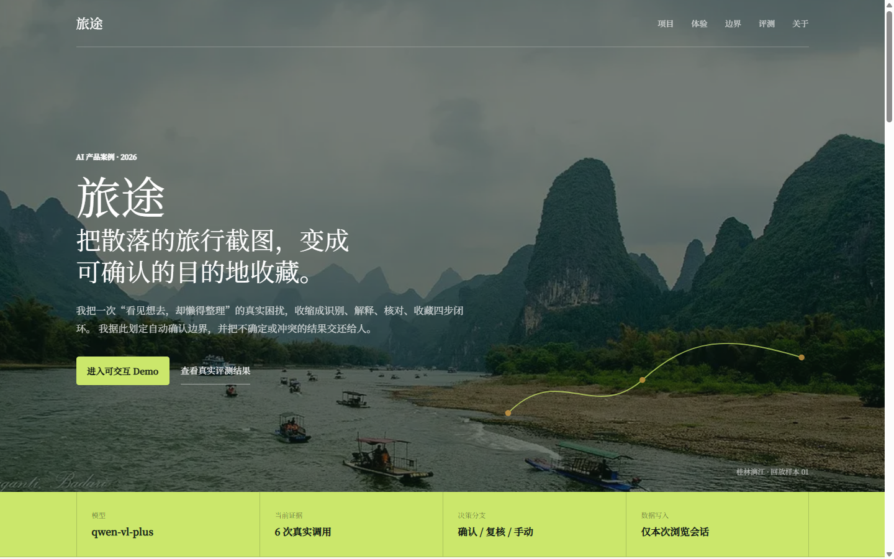
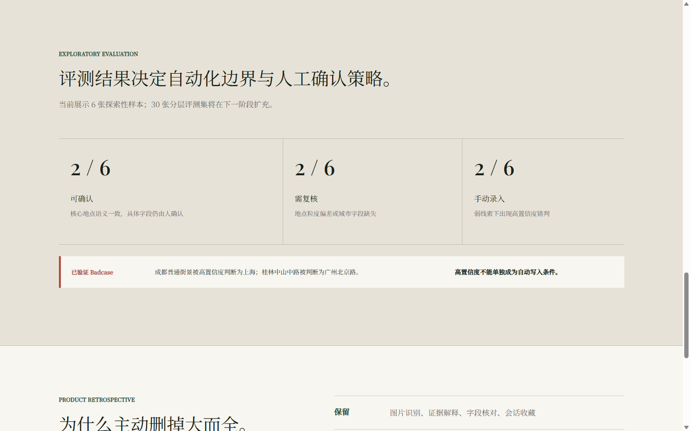
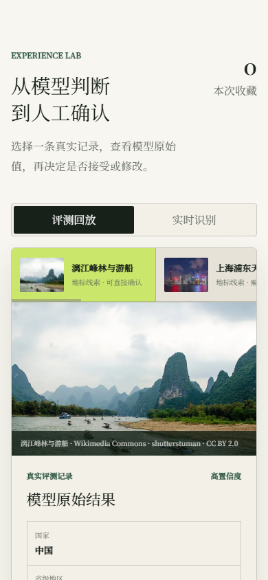
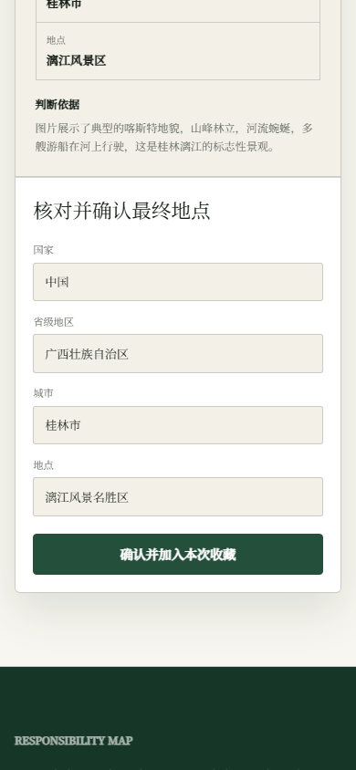
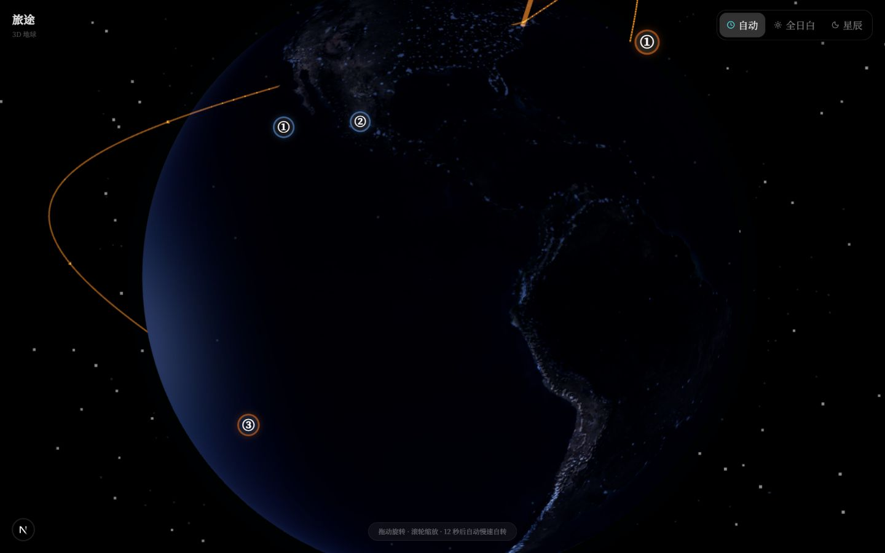

# 旅途 P0 浏览器验收记录

验收日期：2026-08-15

分支：`codex/lvtu-portfolio-redesign`

生产构建本地地址：`http://127.0.0.1:59737/`

## 质量门禁

| 检查项 | 结果 |
| --- | --- |
| `npm run test:run` | 25 项通过 |
| `npm run lint -- --max-warnings=0` | 通过，0 error / 0 warning |
| `npx tsc --noEmit` | 通过 |
| `npm run build` | 通过，首页静态生成，识别接口保持动态路由 |
| `git diff --check` | 通过，仅有 Windows 行尾转换提示 |

## 桌面端 1440 x 900

- 首屏品牌、旅行照片、价值主张和两个行动入口均在首屏可见。
- 五段导航可跳转；“评测”锚点准确落到探索性评测区域。
- 页面宽度与视口一致，无页面级横向滚动。
- 首屏和体验台图片全部加载完成。
- 页面未出现已删除的隐私、调用次数限制或敏感地点示例文案。

## 手机端 390 x 844

- 首屏保留下一段项目事实提示，导航和行动入口无重叠。
- 回放/实时两个 tab 可点击；样本条为预期的横向滚动，不引起页面级横向滚动。
- 样本使用语义化 `ul > li > button`，六个按钮均保留原生按钮角色。
- 四个确认字段 `clientWidth === scrollWidth`，输入框自身不横向滚动。
- 确认按钮宽 306 px，小于 390 px 运行时视口，未被遮挡。
- 未选择文件时“开始识别”禁用；新实时请求会先清空旧识别结果。

## 减少动效

- Chrome 调试协议实际模拟 `prefers-reduced-motion: reduce`，媒体查询返回 `true`，页面滚动行为为 `auto`。
- `TravelPath` 使用 `useReducedMotion()`；偏好减少动效时 `initial=false`，不执行路径入场绘制。
- `globals.css` 的 `prefers-reduced-motion: reduce` 关闭动画与过渡，并取消平滑滚动。
- `TravelPath.test.tsx` 固定 reduced-motion 环境验证上述组件分支。

## 旧页面防回归

- `/cover` 在 1440 x 900 下可见且无应用控制台错误。
- `/globe` 的 WebGL 画布为 1440 x 900，截图非空、无页面级横向滚动。
- 控制台仅有 Three.js 自身的 `Clock` 弃用提醒，不影响本次 P0 首页和交互链路。

## 结论

P0 首页、真实回放、人工确认、实时识别入口、评测口径和移动端布局满足当前规格。探索性样本仍为 6 张；30 张分层评测集属于下一阶段，不在本次结果中冒充已完成证据。
